<div align="center">

# Sistema Gráfico Interativo

**Um sistema gráfico 2D/3D completo escrito do zero em C++ — sem OpenGL, sem bibliotecas de matemática, sem engine.**

Modelagem, transformações, projeção, recorte, rasterização, z-buffer e iluminação Phong rodando de forma paralelizada na CPU.

[](https://en.cppreference.com/)
[](https://github.com/ocornut/imgui)
[](https://www.glfw.org/)
[](#-compilação)
[](LICENSE)


</div>

---

## Sobre o projeto

Este é um **sistema gráfico interativo** desenvolvido para a disciplina de Computação Gráfica. Implementamos a **versão extendida** do sistema gráfico, no qual também fazemos a **rasterização e iluminação**. O projeto foi feito em C++, contrário ao normal da disciplina, que é em python, para conseguir extrair o máximo do processador e tornar possível a renderização sem o uso de CUDA ou alguma biblioteca gráfica como o OpenGL. 

O OpenGL é utilizado indiretamente, pois a biblioteca de interface gráfica **Dear ImGui** utiliza o OpenGL em sua renderização. Porém, em nosso código ele é usado apenas para **exibir uma textura na tela**. A pipeline completa, importação/criação dos objetos, **transformações do objeto**, **normalização das coordenadas**, **rotação da window**, **transformações de perspectiva**, **clipping das bordas**, **z-buffer para checagem de profundidade**, **iluminação Phong**, **transformação de viewport** e **rasterização** de cada pixel em um **FrameBuffer** com SSAA, é toda feita via código e executada em CPU. No final de cada ciclo de renderização, apenas copiamos a textura do FrameBuffer gerado para que o OpenGL mostre na tela.    

- **Nenhuma biblioteca de álgebra linear**: `mat4`, `Point` e as transformações homogêneas são próprias.
- **Nenhuma rasterização de GPU**: os triângulos, linhas e pontos são preenchidos em um framebuffer
  na CPU (função de aresta / baricêntricas, Bresenham)
- **Nenhum shader**: a iluminação Phong é avaliada em C++, por face, por vértice ou por pixel, de acordo com o seletor na interface (None - Flat - Gourand - Phong).

O resultado é um "mini renderizador" navegável, similar ao Blender em certos aspectos.

### A pipeline, do objeto ao pixel

```mermaid
flowchart LR
    subgraph S1["1 · Geometria e projeção"]
        direction TB
        A["<b>Display File</b><br/>objetos + matriz de modelagem"]
        A --> B["<b>Modelagem → VRC</b><br/>matriz do objeto e da câmera<br/>compostas em um só passe"]
        B --> P{"Perspectiva?"}
        P -- não --> N["<b>Window → NCS</b><br/>ortográfica: descarta o Z"]
        P -- sim --> C1["<b>Clip no plano near</b><br/>antes da divisão por w"]
        C1 --> C2["<b>Projeção → NCS</b><br/>x' = x·d / (z+d)"]
    end

    subgraph S2["2 · Recorte e visibilidade"]
        direction TB
        D["<b>Clipping 2D</b><br/>Liang-Barsky <i>ou</i> Cohen-Sutherland<br/>polígonos: Sutherland-Hodgman"]
        D --> E["<b>Coleta de triângulos</b><br/>back-face culling + depth sort<br/><i>o Z ainda existe aqui</i>"]
        E --> F["<b>Transformação de viewport</b><br/>NCS → pixels, × SSAA 1–4"]
    end

    subgraph S3["3 · Rasterização em CPU"]
        direction TB
        G["<b>Rasterização paralela</b><br/>função de aresta · Bresenham<br/>uma faixa de linhas por thread"]
        G --> H["<b>Z-buffer</b><br/><i>ou</i> algoritmo do pintor"]
        G --> I["<b>Shading Phong</b><br/>flat · Gouraud · por pixel"]
        H --> J["<b>Framebuffer</b><br/>resolve box = anti-aliasing"]
        I --> J
        J --> L["<b>Present</b><br/>vira textura na tela<br/><i>o único momento com OpenGL</i>"]
    end

    N --> D
    C2 --> D
    F --> G

    classDef entrada fill:#8957e5,stroke:#6e40c9,color:#fff
    classDef geom    fill:#1f6feb,stroke:#1158c7,color:#fff
    classDef corte   fill:#bf8700,stroke:#9e6a03,color:#fff
    classDef raster  fill:#238636,stroke:#1a7f37,color:#fff
    classDef saida   fill:#da3633,stroke:#b62324,color:#fff
    classDef decisao fill:#30363d,stroke:#8b949e,color:#fff
    classDef etapa   fill:none,stroke:#8b949e,stroke-dasharray:4 4,color:#8b949e

    class S1,S2,S3 etapa
    class A entrada
    class B,N,C2,E,F geom
    class P decisao
    class C1,D corte
    class G,H,I,J raster
    class L saida
```



> Todo o caminho de `Display File` até `Transformação de viewport` é **cacheado**: só roda de novo
> quando a cena, a câmera ou o tamanho do canvas mudam. A rasterização, essa sim, roda todo frame.

---

## O que o aplicativo faz

### Modelagem 2D
Como um dos requisitos da matéria, as versões iniciais do **SGI** são 2D. São exclusivos do modelo 2D:

| Recurso | Detalhe |
|---|---|
| **Primitivas** | Ponto, linha, wireframe (polilinha) e polígono (preenchido ou não) |
| **Curvas de Bézier** | Cadeia de segmentos cúbicos com continuidade nas âncoras (`A C C A C C A…`). Possui continuidade C0 |
| **Curvas B-Spline** | Avaliação por **forward differences**, a partir de N pontos de controle. Possui continuidade C2 |
| **Criação por clique** | Cliques no viewport, `Enter`/duplo-clique confirma, `Esc` cancela |


### Modelagem 3D
Posteriormente, o **SGI** foi extendido para suportar 3D, e assim surgem as principais implementações. É exclusivo do modo 3D:

| Recurso | Detalhe |
|---|---|
| **Câmera VRC** | Sistema de referência de vista completo (VRP, VPN, VUP) com órbita, pan e zoom |
| **Projeção paralela** | Ortográfica, obtida alinhando a VPN ao eixo +Z |
| **Projeção perspectiva** | COP a uma distância focal ajustável — do "telefoto" à grande-angular |
| **Z-Buffer** | Z-buffer para renderização de objetos com diferentes profundidades no mesmo pixel, onde o mais próximo é renderizado |
| **Primitivas** | Primitivas adaptadas ao 3D, ponto 3D, linha, wireframe, poligono... Criação dos objetos com o mouse é desabilitada no modo 3D. |
| **Superfícies bicúbicas** | Patches de 16 pontos de controle, em versão **Bézier** e **B-Spline** |
| **Bounding box** | Caixa envolvente opcional para dar noção de profundidade |

### Renderização
Depois que os valores do objeto são definidos no `src/gui/ObjectCreator.hpp` ou pelo `src/io/ObjSerializer.hpp`, ele passa para o `src/core/EntityManager.hpp`, onde sua criação é efetivada e o objeto é guardado no `src/window/DisplayFile.hpp`. A cada frame, o loop renderiza os objetos do display file no viewport, executando o pipeline:

| Recurso | Detalhe |
|---|---|
| **Rasterizador em CPU** | Framebuffer próprio, os objetos são desenhados utilizando métodos de desenhar ponto, linha e triângulo preenchido. Paralelizado, cada thread recebe uma faixa de y para renderizar (Varre todos os objetos), não há condição de corrida. |
| **Recorte 2D** | **Liang-Barsky** e **Cohen-Sutherland**, alternáveis em tempo real (Requisito da disciplina); polígonos por Sutherland-Hodgman |
| **Recorte 3D** | O recorte 3D é o mesmo do 2D, depois de aplicada a projeção. No 3D, por conta da perspectiva, também é feito o clipping no plano *near* antes da divisão perspectiva |
| **Visibilidade** | **Z-buffer** por pixel *ou* **algoritmo do pintor** (ordenação por profundidade) |
| **Back-face culling** | Com convenção de winding invertível para modelos "ao contrário" |
| **Anti-aliasing** | **SSAA** de 1× a 4×: rasteriza k^2 framebuffers para obter uma resolução maior e faz resolve box na apresentação. Isso deixa as linhas mais suaves, porém aumenta o custo computacional drasticamente |
| **Paralelismo** | Quase todo o pipeline é paralelizado via criação de threads localmente em cada etapa, com implementação nativa porém também com a biblioteca TBB (Utilizada inicialmente por ser melhor, com certas otimizações se tornou um pouco obsoleta). |

### Iluminação
A iluminação, como mencionada anteriormente, implementa o modelo de Phong, que divide a luz entre luz Ambiente, Difusa e Especular. Esses parâmetros são editáveis apenas no arquivo .mtl que é carregado junto ao arquivo .obj de mesmo nome. 

| Recurso | Detalhe |
|---|---|
| **Modelo de Phong** | Ambiente + difuso (Lambert) + especular, com `ka/kd/ks/Ns` vindos do `.mtl`. Sob um ponto P, calcula qual deveria ser sua cor. Esse é o unico modelo de iluminação implementado, os demais variam de acordo com o escopo em que são usados |
| **Flat shading** | Calcula o Phong uma só vez por face, a face inteira recebe a mesma cor |
| **Gouraud shading** | Calcula o Phong para cada vértice do triângulo, cada pixel da face recebe uma interpolação com peso das cores dos vértices |
| **Phong shading** | Calcula o Phong para **cada pixel** rasterizado. É o mais pesado |
| **Luz ambiente** | Podemos mudar a cor da luz ambiente, apesar de sua intensidade ser definida pelo .mtl |
| **Luzes** | É possível adicionar quantos pontos de luz você quiser, com posição, cor e intensidade editáveis |
| **Headlight** | Luz farol para visualização dos objetos |

### Transformações e animação

- Translação, escala e rotação **em torno do centro do objeto, da origem ou de um ponto arbitrário**.
- Rotação 3D em torno de um **eixo qualquer**.
- As transformações são **acumuladas em um buffer** e aplicadas de uma vez como uma única matriz
  composta (`Apply all transformations`), requisito da disciplina.
- **Múltiplos objetos** podem ser transformados simultaneamente.
- **Animação**: qualquer sequência de transformações pode ser interpolada ao longo de N segundos, opcionalmente em *loop* — inclusive lida de um script (veja `models/donut_spin.txt`, que implementa o clássico 'Donut Spin').

### Importação e exportação

- **`.obj` + `.mtl`** completos: vértices, faces, grupos, materiais, `mtllib`/`usemtl`.
- Importar `"models/mk4"` carrega automaticamente o `.obj` e o `.mtl` correspondente.
- Exportação da cena inteira de volta para `.obj`/`.mtl`.
- A pasta [`models/`](models/) já vem com vários modelos de teste (`mk4`, `cristo`, `Goro`,
  `subzero`, `Donut`, superfícies de Bézier e B-Spline…).

---

## Galeria

<div align="center">

|  |  |  |
|:--:|:--:|:--:|
| **Curvas 2D**<br><sub>Bézier e B-Spline construídas clique a clique,<br>recortadas nas bordas da window</sub> | **Superfícies bicúbicas**<br><sub>patches de Bézier e B-Spline tesselados,<br>preenchidos e com z-buffer</sub> | **Câmera em perspectiva**<br><sub>órbita e distância focal em uma cena<br>com dezenas de malhas importadas</sub> |

</div>

<br>

<div align="center">


**Modelos de iluminação** — alternando entre *None*, *Flat*, *Gouraud* e *Phong*.
</div>

<br>

<div align="center">


**Animação por script** — o donut de `donut.c` girando a partir de `models/donut_spin.txt`, com transformações interpoladas em loop. Modelo exportado do Blender encontrado online e exportado como .obj. 
</div>

---

## Controles

| Ação | Atalho |
|---|---|
| Zoom | Scroll do mouse ou `Ctrl` + `↑`/`↓` |
| Pan / translação da window | Arrastar com o **botão direito** ou `Shift` + setas ou `Shift` + Scroll do mouse |
| Rotação da window (2D e 3D) | `Ctrl` + `Shift` + `←`/`→` ou `Ctrl` + `Shift` + Scroll (Funciona melhor com scroll analógico ou touchpad)|
| Distância focal (perspectiva) | `Shift` + scroll |
| Confirmar criação | `Enter` ou duplo-clique |
| Cancelar criação | `Esc` |

### Janelas da interface


- **Viewport** — É onde o framebuffer é desenhado, e é onde podemos interagir com o mundo e modificar as configurações de renderização.
- **Object Creator** — menu de criação de objetos, e também o IO de arquivos .obj (e .mtl, se presentes).
- **Object Manager** — lista de objetos, detalhes, seleção múltipla e manipulação dos objetos.
- **Lighting** — modelo de shading, luz ambiente, headlight e editor de luzes pontuais.
- **Log** — registro das ações, ignorável.

Todas as janelas são móveis e redimensionáveis; `Reset Layout` devolve tudo ao lugar
(o layout padrão é calculado em função da resolução e do DPI do monitor).

---

## Compilação

**Dependências:** compilador com C++20, GLFW e (opcional, não é necessário) Intel TBB.

```bash
# Ubuntu / Debian
sudo apt install build-essential libglfw3-dev libtbb-dev

make fast -j16     # build otimizado (-O3)
./programa_foda.out
```

O `make` detecta o TBB automaticamente: se estiver disponível, a paralelização usa
`std::execution`; caso contrário, cai em um fallback nativo — o programa funciona igual,
só mais devagar.

<details>
<summary><b>Cross-compilação para Windows a partir do Linux</b></summary>

```bash
make windows -j16        # standalone, sem TBB (mais lento, mas um .exe só)
make windows_fast -j16   # com TBB, empacota as DLLs necessárias em um .zip
```

Usa o MinGW-w64 e os binários pré-compilados em `libs/windows/`. O build `windows_fast`
exige que `libtbb12.dll`, `libgcc_s_seh-1.dll`, `libstdc++-6.dll` e `libwinpthread-1.dll`
fiquem no mesmo diretório do executável (o alvo já cuida disso).

</details>

---


## Autores

Desenvolvido por **[Kauan Fank](https://github.com/Itaxo01)** e **Abel Scheidt**
para a disciplina de Computação Gráfica.

Interface construída com [Dear ImGui](https://github.com/ocornut/imgui) e [GLFW](https://www.glfw.org/).
